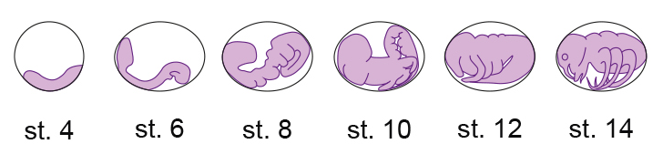
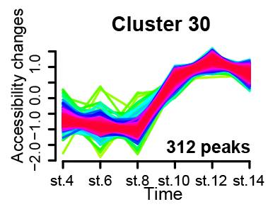

```{r setup, include=FALSE}
knitr::opts_chunk$set(echo = TRUE,message=FALSE, warning=FALSE, results='hide')
```

# 1. GREAT

**GREAT** (Genomic Regions Enrichment of Annotations Tool) is a type of functional enrichment analysis directly performed on genomic regions. This tool allows to predict **functions of cis-regulatory regions** through a linear **association** of regions (potential CREs) to genes and a later **gene ontology** analysis.

In this exercise, we will use GREAT to explore the regulatory landscape of late embryogenesis in the mayfly ***Cloeon dipterum***, a **non-model insect** that has emerged as an informative system from evolutionary, regulatory and developmental perspectives.

Late embryogenesis is a period marked by the activation of gene regulatory programmes that shape key insect traits, including tissue differentiation and the final establishment of body plan features. By analysing **ATAC-seq** clusters that open and remain accessible during these stages, we capture regulatory regions likely involved in driving these developmental transitions. This provides an ideal context for applying GREAT, as it allows us to infer the biological processes potentially controlled by cis-regulatory elements during a **morphogenetically dynamic period**.

We will take advantage of a previous **M-fuzz analysis** performed over the ATAC peaks in development and choose the ATAC regions that get opened and mantained in late-embryonic development (<https://doi.org/10.1242/dev.203017>).

{width="500"}

{width="200"}

Using **rGREAT** we will address which are the assoicated genes to these putative CREs and in why biological functions are they involved.

All the data used is publicly available data and all the files relevant for the session can be found at <https://zenodo.org/records/17350362>

The genome version from *Cloeon dipterum* we are usining is **GCA_902829235.1** and can be explored through the UCSC browser.

### 1.1 Session preparation

```{r}
# Remove the # to install packages if they are not yet installed

# install.packages("dplyr")
# BiocManager::install("rGREAT")
# BiocManager::install("GenomicRanges")
# BiocManager::install("org.Dr.eg.db")
# BiocManager::install("GenomeInfoDb")

library(dplyr)
library(GenomicRanges)
library(IRanges)
library(rGREAT)
library(GenomeInfoDb)
library(ggplot2)
library(readr)
setwd("~/NT-evo-devo/evodevo2025")
# Use sessioninfo() to check which version of each package is active in your session

```

### 1.2 Preparation of peak file

```{r}

peaks <- read.table("data/cluster30_peaks.bed", sep = "\t", header = FALSE) %>%
  dplyr::select(V1, V2, V3)

colnames(peaks) <- c("chr", "start", "end")

gr_peaks <- GRanges(
  seqnames = peaks$chr,
  ranges   = IRanges(start = peaks$start +1, end = peaks$end +1) #0-based vs 1-based genomics
)


```

a)  Display the first 6 rows using *head()* and describe which scaffolds appear

b)  Display the gr_peaks object.

c)  • How many regions are there? (using *length()*)

d)  • What type of object is it? (Using *class()*)

e)  Peaks come from an ATAC-seq cluster. What biological signal do you expect from this cluster?

### 1.3 Preparation of the TSS file

```{r}

tss_df <- read.table("data/clodip_v4_TSS.bed", sep="\t", header = FALSE)
colnames(tss_df)<-c("chr", "start", "end", "gene_id", "score", "strand")

tss <- GRanges(
  seqnames = tss_df$chr,
  ranges   = IRanges(start = tss_df$start +1, end = tss_df$end +1), #0-based vs 1-based genomics
  strand   = tss_df$strand,
  gene_id  = tss_df$gene_id
)

```

Explore the data:

• Do you recognise the gene IDs?

• In *AnnotCdipV1_FlybaseSymbol_clodipv4.tsv* you can find the equivalence between different gene_IDs between Cloeon and Drosophila. Use them to browse your favourite gene in UCSC.

#### 1.3.1 Scaffold lenghts

We are not working with a chromosome resolved genome but with a scaffolded genome.

```{r}
scaf_len <- read.table("data/genome_CADEPI01_2023_scaffold_lengths.tbl",sep="\t", header = FALSE)
colnames(scaf_len) = c("chr", "len")


chr_lengths <- setNames(scaf_len$len, scaf_len$chr)

# genes
seqlengths(tss) <- chr_lengths[seqlevels(tss)]

# Picos
seqlengths(gr_peaks) <- chr_lengths[seqlevels(gr_peaks)]

```

#### 1.3.2 Expansion of gene domains

```{r}
extss <- extendTSS(
  tss,
  seqlengths    = seqlengths(tss),
  basal_upstream   = 1000,
  basal_downstream = 500,
  extension        = 1e4, 
  gene_id_type     = "SYMBOL"  
)

```

a)  What would happen if extension were 1,000,000 bp instead of 10,000 bp? Would this impact the number of genes assigned to peaks? When are we obtaining more false positives assignments?
b)  Check if we are using GREAT recommended distances: DOI 10.1038/nbt.1630

Then, we have to make a small adjustment to avoid the program crashing:

```{r}
    orig <- seqlevels(tss)   
    
    # For each scaffold we create new names that are understandable for GREAT
    new  <- paste0("chr", seq_along(orig))
    names(new) <- orig
     
#The scaffolds have to be renamed
    tss2      <- renameSeqlevels(tss,      new)
     gr_peaks2 <- renameSeqlevels(gr_peaks, new)
     extss2       <- renameSeqlevels(extss,       new)
```

Note: we are still working with scaffolds! Check how many scaffolds there are with *lenght(orig)*

### 1.4 Loading of the GO information

For model organisms GREAT software

For non-model organisms the Gene Ontonlogy (the association of a certain gene to one or more ontologies) can be reconstructed using FANTASIA ([https://doi.org/10.1038/s42003-025-08651-2](#0))

```{r}

go<- read.table("data/clodip_v4_GO_long.txt", sep=" ", header = TRUE)
head(go, 5)

gs_all <- split(go$gene_id, go$go_id)

```

Note: gene_id has to match the gene_id in the tss file.

### 1.5 Running rGREAT

```{r}

go_obj <- great(
       gr           = gr_peaks2,
       gene_sets    = gs_all,    # tu lista GO
       extended_tss = extss2,
       background   = NULL,
       exclude      = NULL
     )

```

a)  Run the code and check that *go* is created without errors. What does the Warning message tell us?
b)  Inspect the go object in the console.

### 1.4 Getting and exploring the enrichment table

```{r}
enrich <- getEnrichmentTable(go_obj, min_region_hits = 5)
     
head(enrich, 10)

```

a)  List the table columns using *colnames()*.Which columns seem most biologically relevant?

b)  Filter significant terms:

```{r}

enrich_sig <- enrich %>%  filter(p_adjust <= 0.05)

nrow(enrich_sig)
```

c)  Change min_region_hits to 10. Does the number of significant terms increase or decrease?

### 1.6 Data visualization

Use the following lines for plotting a buble-plot. Change the variables to the columns you find interesting.

```{r}

top10 <- enrich %>%
  arrange(p_adjust) %>%
  head(10)

gg <-ggplot(top10,
       aes(x = -log10(p_value), y = reorder(description, p_value),
           size = fold_enrichment_hyper, color = observed_gene_hits)) +
  geom_point() +
  #facet_wrap(~ direction, scales = "free_y") +
  scale_y_discrete(limits = function(x) rev(x)) +
  labs(x = "-log10(p-value)", y = NULL, size = "Prevalence", color = "Nº of genes") +
  labs(title ="Mayfly late embryogenesis (cluster30)")+
  theme_minimal()


```

### 1.7 Questions

1.  Does it make sense to use this with all the peaks from an ATACseq file? What will we see?

2.  What biological signal do the enriched terms reflect?

3.  What limitations of GREAT you can identify?

4.  How would the results change if:

    -   you used a promoter-only assignment (no extension)

    -   you used 1 Mb assignment

    -   you used gene deserts / intergenic peaks?
