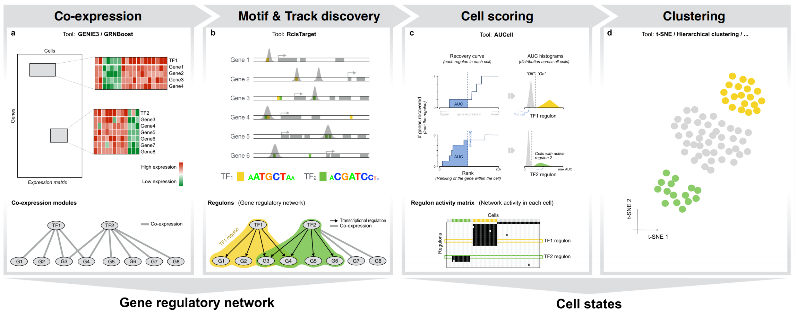
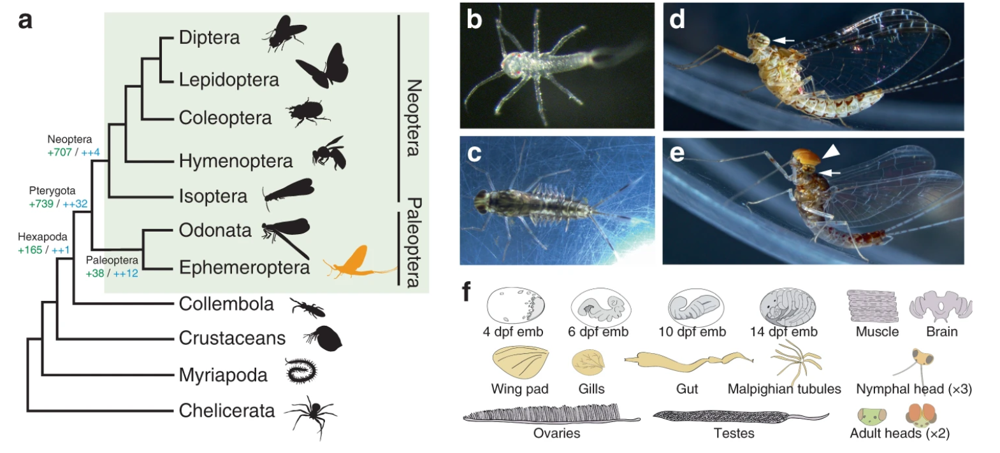

```{r setup, include=FALSE}
knitr::opts_chunk$set(echo = TRUE, message=FALSE,  eval = FALSE,warning=FALSE, results='hide')
```

# GRN inference from transcriptomic and accesibility genomic data

In this exercise we will explore how to build GRN from bulk or sc-RNAseq and ATACseq data.

The session is designed following the workflow of the **SCENIC** ecosystem ([scenic.aertslab.org](https://scenic.aertslab.org/){.uri}) and has been adapted to low computational requirements.

Basically we will build a transcription-based network, then a cis-regulatory network will be loaded to the session, exploring how this was built, and finally we will merge these two informative datasets to obtain a strongly supported GRN, being able to identify which of the defined regulons (units of regulation based on TFs) are active in each cell and in whic level.

{width="500"}

#### Scientific background

We will take advantage of the genomic and transcriptomic data generated from males and females mayflies, which develop sex-dependent diverse neural and optical structures. 

{width="500"}

#### Session Set up

All the guidelines for installation of the required packages are in <https://htmlpreview.github.io/?https://github.com/aertslab/SCENIC/blob/master/inst/doc/SCENIC_Setup.html>

```{r installation}

## Identify available resources
system("nproc", intern = TRUE)

## Install minimal required packages
install.packages(c("doRNG", "doParallel", "pheatmap", "devtools"))

# GENIE3, AUCell, RcisTarget from GitHub
library(devtools)

devtools::install_github("aertslab/GENIE3")
devtools::install_github("aertslab/AUCell")
devtools::install_github("aertslab/RcisTarget")
```

Once the packages are correctly installed, load them to the session and check the installled version:

```{r}
library(doRNG)
library(doParallel)
library(AUCell);      packageVersion("AUCell")
library(GENIE3);      packageVersion("GENIE3")
library(RcisTarget); packageVersion("RcisTarget")
library(pheatmap)
library(dplyr)
```

## 2.1 Network inference through co-expression modules

We will first generate a co-expression network based on the expression dataset, obteined from a sc-RNAseq of male and female mayflies.

### 2.1.1 Preparation of expression data

Load an already extracted normalized expression matrix from mayfly eye scRNA-seq data and its metadata.

```{r}
exprMat_dense <- readRDS("data/exprMat_nymph3_eye_SCENIC_80-5.rds")
meta          <- readRDS("data/meta_nymph3_eye_SCENIC_80-5.rds")
umap          <- readRDS("data/umap_nymph3_eye_SCENIC_80-5.rds")

dim(exprMat_dense)
head(meta)
colnames(meta)

```

1.  What do the two numbers returned by dim(exprMat_dense) represent?

2.  Inspect colnames(meta). Which columns look informative to compare regulatory activity between cell types or sexes?

Note: As you can apreciate, bulk expression data can be loaded if following the same format, indicating samples in the place of cells.

### 2.1.2 Loading of TF in mayfly

The mayfly TFs have been defined through orthology and filtered to ensure they have defined binding profiles (motifs) in the custom database.

```{r}

tfs <- read.table("data/clodip_v4_TF.txt",
                  header = FALSE, sep = "\t",
                  stringsAsFactors = FALSE)
tfList <- tfs$V1

# Explore the TF list
length(tfList)
head(tfs)

# Keep only TFs that are actually present in the expression matrix
tfList <- intersect(tfList, rownames(exprMat_dense))
length(tfList)

```

1.  Compare the number of TFs before and after the `intersect` step. How many TFs are actually expressed in this dataset?

### 2.1.3 Co-expression modules through GENIE3

The coexpression modules will be generated usinig **GENIE3** ([https://github.com/vahuynh/GENIE3)](https://github.com/vahuynh/GENIE3).) over the normalized expression matrix.

Developed originally for bulk transcriptional data, GENIE3 computes the regulatory network for each gene independently. It uses tree-based ensemble methods such as random forests to predict the expression profile of each target gene from profiles of all the other genes. The weight of an interaction comes from the importance of an input gene in the predictor for a target gene’s expression pattern. Aggregating these weighted interactions over all the genes yields the regulatory network. An adaptation to sc data can be found under the name of GRNBoost2.

This method was the top performer in the DREAM4 in silico network challenge (multifactorial subchallenge). GENIE3 was also shown to be a good model for Network prediction: <https://www.nature.com/articles/s41592-019-0690-6>

```{r}
set.seed(123)

weightMat <- GENIE3(exprMat_dense,
                    regulators = tfList,
                  #  nTrees     = 10,    
                    nCores     = 32)

    dim(weightMat)   # genes x TFs

# Convert weight matrix to ranked list of edges
linkList <- getLinkList(weightMat)
    head(linkList)

# Inspect distribution of weights
hist(linkList$weight, breaks = 100,
     main = "Weighted distribution from GENIE3")

# Threshold edges at the 95th percentile
percentile_95 <- quantile(linkList$weight, 0.95)
filt <- linkList[linkList$weight > percentile_95, ]
    dim(filt)

write.table(filt, file = "data/linkList95_Genie3.txt", col.names = FALSE, row.names = FALSE, quote=FALSE)    
```

1.  What do the rows and columns of weightMat represent?

2.  Inspect head(linkList): identify which columns correspond to TF, target gene and interaction weight.

3.  Look at the histogram of weights: is the distribution uniform, skewed, long-tailed…? What does that tell you about the number of strong vs. weak interactions?

With now some data.frame rearrangements we can build TF-centered modules from the filtered edges.

These way of organising the information will be usefull for later analysis.

```{r}
#Build TF modules (TF → list of target genes)

minTargets <- 20   
maxTargets <- 200

tfModules <- filt %>% group_by(regulatoryGene) %>%
  summarise(targets = list(unique(targetGene)[1:min(maxTargets, n())])) %>%
  ungroup() %>% filter(lengths(targets) >= minTargets)

        length(tfModules$regulatoryGene)

# Convert to a named list for RcisTarget: geneSets[[TF]] = vector of targets
geneSets <- setNames(tfModules$targets, as.character(tfModules$regulatoryGene))
        
        length(geneSets)
        str(geneSets[1:3])

```

## 2.2 Motif enrichment with RcisTarget

We now integrate sequence-level information by identifying transcription factor **binding motifs** enriched **among the target genes** of each **TF module**.

Using a custom motif ranking database for the mayfly genome, we test which motifs (and therefore which TFs) **support the co-expression modules** inferred by GENIE3. This step adds regulatory evidence beyond correlation.

#### Mayfly motif ranking database

The custom motif-ranking database of mayfly has been built following a workflow based on genome-wide motif scanning using **Cluster-Buster** ([DOI:[10.1002/neu.480230907](DOI:%5B10.1002/neu.480230907){.uri}](#0) , <https://resources.aertslab.org/cistarget/> ).

In this approach, each **TF motif is mapped across the genome** to identify all potential binding sites, and Cluster-Buster assigns **scores to** **motif clusters** within defined regulatory regions (typically promoters or extended gene regulatory domains). These scores are then transformed into *rankings* that order genes by the likelihood of being regulated by each motif. The resulting “motif-ranking database” is stored in feather format and used by RcisTarget to perform enrichment analysis.

Load the cis-regulatory database and the corresponding annotations.

```{r}
dbFile <-"data/clodip_v4.genes_vs_motifs.rankings.feather"
motifRankings <- importRankings(dbFile)  

      head(getRanking(motifRankings)[,1:5])


motifAnnotations <- read.table("data/motif_Annotations_clodip.txt", header = TRUE, sep = "\t")
motifAnnotations<-as.data.table(motifAnnotations)
    head(motifAnnotations)


```

1.  In `getRanking(motifRankings)[, 1:5]`, what are rows and columns representing?
2.  In head(motifAnnotations), what information are we recovering?
3.  Which is the strongest link from these rows and columns?

#### 2.2.1 Motif enrichment analysis

Run the motif enrichment over all TF modules:

```{r}


motifEnr <- RcisTarget::cisTarget(
  geneSets       = geneSets,
  motifRankings  = motifRankings,
  motifAnnot     = motifAnnotations,
  nesThreshold   = 3.0,
  aucMaxRank     = 0.1 * ncol(motifRankings), 
  nCores         = 32,
  verbose        = TRUE
)
fin <- Sys.time()
motifEnr
motifEnr_df <- as.data.frame(motifEnr)

```

1.  Inspect head(motifEnr_df). Which columns tell you “how strong” the enrichment is?

2.  What information is contained in the enrichedGenes column? Why is this useful for building regulons?

### 2.2.2 Getting regulons

Here we combine the results of GENIE3 and RcisTarget: for each TF, we intersect its co-expression targets with the motif-supported targets to define a “regulon.” Regulons represent high-confidence TF-driven gene programs supported both by expression patterns and regulatory motif enrichment.

```{r}


getRegulonFromMotifs <- function(tfName, geneSets, motifEnr_df, topMotifs = 5) {
                          # Co-expression module for this TF
                                  gs <- geneSets[[tfName]]
                                  if (is.null(gs)) return(NULL)
                          
                          # Motif enrichment entries for this TF
                                  enr_tf <- motifEnr_df[motifEnr_df$geneSet == tfName, , drop = FALSE]
                            
                          # Top motifs by NES
                                  enr_top <- enr_tf[order(-enr_tf$NES), ][1:min(topMotifs, nrow(enr_tf)), ]                          
                          # Extract enriched genes (semicolon-separated) and flatten
                                  motifTargets <- enr_top$enrichedGenes |>  strsplit(";") |> unlist() |>  unique()
                          
                          # Regulon = genes in the TF’s module AND supported by motifs
                                  regulonGenes <- intersect(gs, motifTargets)
                                  if (!length(regulonGenes)) return(NULL)
  
                           regulonGenes
                          }

regulons <- lapply(names(geneSets), getRegulonFromMotifs,
                   geneSets = geneSets, motifEnr = motifEnr_df, topMotifs = 5)

names(regulons) <- names(geneSets)
regulons <- regulons[!vapply(regulons, is.null, logical(1))]
regulons <- regulons[lengths(regulons) > 0]


length(regulons)
str(regulons[1:3])


```

1.  Compare the definition of a TF module (from GENIE3) and a regulon (GENIE3 + RcisTarget). What extra evidence do regulons require?

2.  Why do we only keep the top topMotifs by NES when building regulons? What could happen if we included all motifs regardless of NES?

## 2.3 Quantifying regulon activity with AUCell

**AUCell scores** how active **each regulon is in each individual cell** by computing the enrichment of regulon genes within the top-expressed genes of each cell. This produces a regulon-by-cell activity matrix, enabling direct comparison of regulatory programs across clusters, sexes or developmental stages.

```{r}


cells_rankings <- AUCell_buildRankings(exprMat_dense)
regulonAUC     <- AUCell_calcAUC(regulons, cells_rankings, nCores = 32)
regulonAUC_mat <- getAUC(regulonAUC)
dim(regulonAUC_mat)


```

1.  What do the rows and columns of regulonAUC_mat represent?

2.  How would you interpret a cell with a very high AUC for a given regulon? And a very low AUC?

## 2.4 Visualization of regulatory activity

Finally, we visualize the activity of selected regulons. UMAP plots colored by AUC values highlight spatial patterns of TF activity across cellular states, while heatmaps allow comparison of regulon activity across groups such as cell types or sexes. Together, these visualizations help interpret the regulatory landscape of the dataset.

```{r}
reg <- "clodip_v4_10094"

# Ensure consistent cell order
cells   <- colnames(exprMat_dense)
auc_vec <- regulonAUC_mat[reg, cells]

emb  <- umap[cells, , drop = FALSE]
df <- data.frame(
  UMAP_1 = emb[, 1],
  UMAP_2 = emb[, 2],
  AUC    = as.numeric(auc_vec)
)

par(mar = c(4, 4, 2, 1))
pal    <- colorRampPalette(c("#FFFFBF", "#FDAE61", "#D7191C"))
nCols  <- 100
cols   <- pal(nCols)

auc_range  <- range(df$AUC, na.rm = TRUE)
auc_breaks <- seq(auc_range[1], auc_range[2], length.out = nCols)
col_index  <- findInterval(df$AUC, auc_breaks, all.inside = TRUE)
pt_cols    <- cols[col_index]

plot(df$UMAP_1, df$UMAP_2,
     col  = pt_cols,
     pch  = 16,
     cex  = 1.2,
     main = reg,
     xlab = "UMAP_1",
     ylab = "UMAP_2")

```


Let's take a look to the appereance of the genes in a Heatmap.

```{r}
install.packages(pheatmap)

library(pheatmap)

regVar   <- apply(regulonAUC_mat, 1, var)
selRegs  <- names(sort(regVar, decreasing = TRUE))[1:30]
mat      <- regulonAUC_mat[selRegs, , drop = FALSE]

meta_sub <- meta[colnames(mat), , drop = FALSE]

annotation_col <- data.frame(
  cell_type_vs = meta_sub$cell_type_vs,
  sex          = meta_sub$sex
)
rownames(annotation_col) <- colnames(mat)

cell_order <- order(annotation_col$cell_type_vs)

mat2 <- regulonAUC_mat[reg_vec, , drop = FALSE]

pheatmap(
  mat2[, cell_order],
  cluster_rows   = TRUE,
  cluster_cols   = FALSE,
  show_rownames  = TRUE,
  show_colnames  = FALSE,
  scale          = "row",
  annotation_col = annotation_col
)

```

## 2.5 Further downstream analysis

Take a look to the aspect of the generated network in Cytoscape (web.cytoscape.org).

The file to load is named "regulons_for_cytoscape_general.csv", and would be a reorganized output from the excercise just performed.
